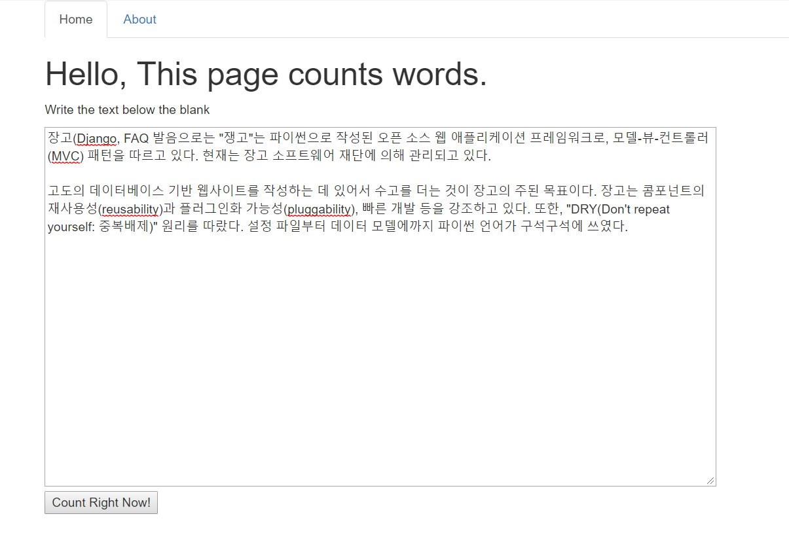
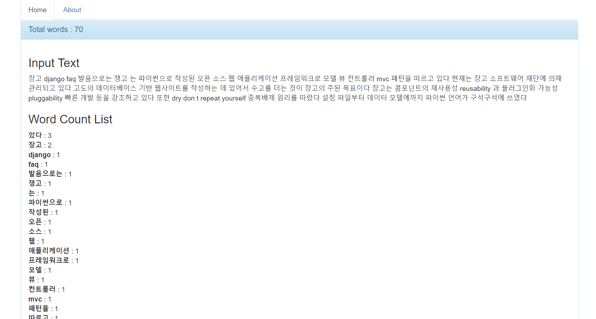
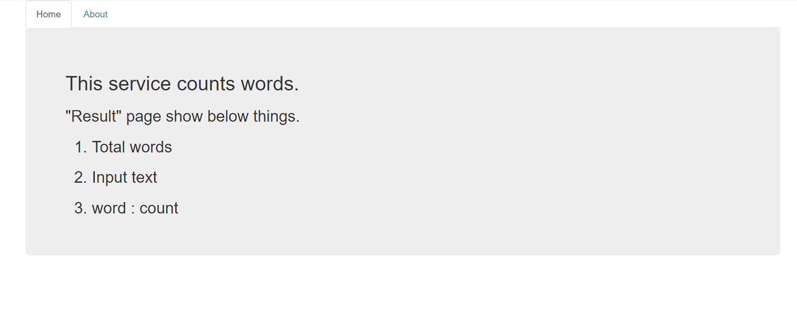

# WordCount

## App
- Input your text.
- Result
  - Total word number
  - Input your text
  - word : count
* word count list is sorted with descending order

### Requirements
```bash
$ pip install -r requirements.txt
```
### Run the app
```bash
$ python manage.py runserver
```

### Result
- home



- result



- about


